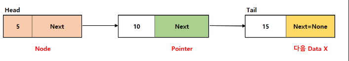
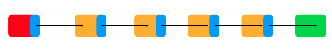
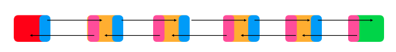
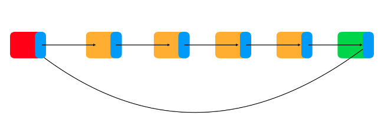

# 연결 리스트(Linked List)

## 개념
 - 배열의 단점을 개선하기 위해 생긴 자료구조이다.
 - 노드를 저장할 때 다음 순서의 자료가 있는 위치를 데이터에 포함시켜 저장하는 방식이다.

 

### 구조
 - 일반적으로 구조체와 포인터로 구성된다. 포인터가 없는 언어의 경우 포인터역할 을 수행하는 레퍼런스로 구현한다.  

 - `노드(Node)` : 데이터와 다음 데이터를 가리키는 포인터로 이뤄져있다.
 - `포인터(Pointer)` : 각 노드에서 다음 데이터를 가리키는 주소값을 가진다.
 - `Head` : 연결 리스트에서 가장 시작점이 데이터를 의미한다.
 - `Tail` : 연결 리스트에서 가장 마지막 데이터를 의미한다.
 - `Next` : 다음 데이터가 없을 경우 포인터의 주소값은 `None` or `Null`이다.

 

## 장ㆍ단점
 - 장점
   - 데이터 공간을 미리 할당할 필요 없이 노드를 포인터로 연결해서 공간적인 효율성을 극대화시킨다.
   - 데이터의 삽입, 수정 시 시간복잡도는 O(1)이다.
 - 단점
   - 다음 노드에 대한 주소를 가져야되어 저장공간 효율이 높지않다.
   - 배열과 달리 탐색 작업 시의 시간복잡도는 O(N)이다.
   - 중간 노드를 제거 시 이전, 다음 노드를 연결하고 재구성하는 코드가 필요하다.

 

## 종류
 - 단순 연결 리스트  

   - 가장 단순한 형태의 연결리스트이다.
   - 다음 노드에 대한 포인터만 가진다.
   - `Head` 노드를 참조하는 주소를 읽어버릴 경우 데이터 전체를 쓰지 못할 수 있다.
   - 일반적으로 `Queue`를 구현할 때 많이 사용된다.  
 - 이중 연결 리스트  

   - 이전, 다음 노드에 대한 포인터를 가진다.
   - 뒤로 탐색하는 게 빠르며 노드를 추가, 제거하는 데 용이하다.
   - 포인터가 2개 있기 때문에 데이터 정렬의 경우 작업량과 자료구조의 크기가 커진다.  
 - 순환 연결 리스트  

   - 이전, 다음 노드에 대한 포인터를 가지며, 마지막 노드가 헤드 노드를 가리킨다.
   - 스트림 버퍼의 구현에 많이 사용되며, 할당된 메모리 공간을 삭제하고 재살당하는 부담이 없기 때문에 `Queue`를 구현하는 데에도 적합하다.

 

## 사용 사례
 - 배열의 한계를 극복하기 위해 사용
 - 삽입, 삭제가 빈번히 일어나는 경우에 사용
   - 단, 배열의 경우 탐색에서 리스트보다 더 적합하다.
 - 커널 모드 프로그래밍에서 사용
   - 커널 모드 성능상 데이터를 굉장히 빠르게 처리해야하기 때문에 삽입/삭제가 자유로운 연결 리스트를 사용한다.

 